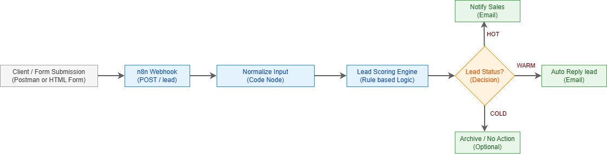
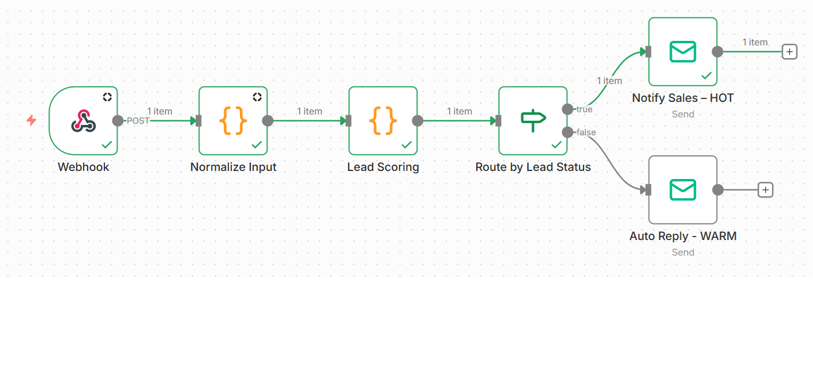
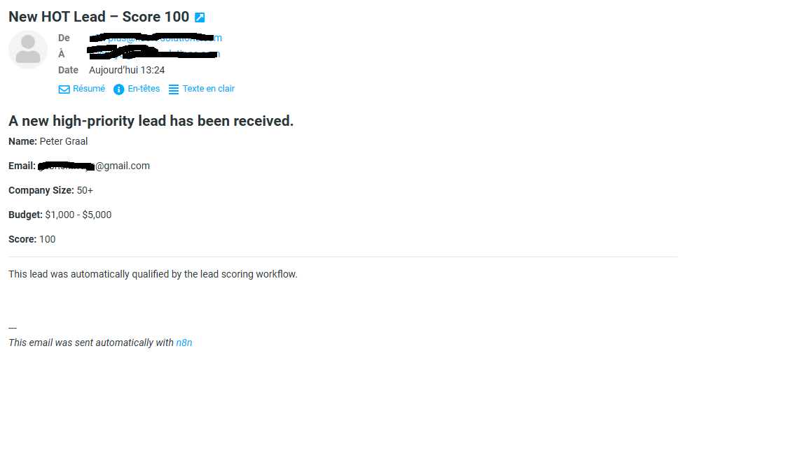

# Project Overview

## 🧠 Lead Qualification Automation (n8n)

**Automated lead qualification and routing using n8n (self-hosted).**

This project demonstrates how to build a complete business automation workflow that:

- receives leads via HTTP webhook
- normalizes incoming data
- applies rule-based lead scoring
- automatically routes leads based on priority
- sends notifications and responses

## 🚀 Use Case

Companies often receive many leads but lack an automated way to prioritize them.

This workflow automatically evaluates each lead based on:

- company size
- budget
- urgency
- keyword analysis

Each lead is classified as **HOT**, **WARM**, or **COLD**, triggering the appropriate action.

## 🏗️ Architecture

### Architecture Diagram



## 🔧 Tech Stack

- n8n (self-hosted on AWS)
- JavaScript (Code nodes)
- SMTP Email
- Webhooks (HTTP API)

## 🧩 Scoring Logic (Summary)

| Criteria     | Points |
| ------------ | ------ |
| Company size | 10–30  |
| Budget       | 5–40   |
| Urgency      | 10     |
| Keywords     | 20     |

**Classification:**

- HOT ≥ 70
- WARM 40–69
- COLD < 40

## 🧪 Example Payload (Postman)

```bash
{
    "fullname": "Peter Graal",
    "email": "peter.graal@gmail.com",
    "company_size": "50+",
    "estimated_budget": "$1,000 - $5,000",
    "need": "We need an automation system for our sales process.",
    "urgent": "Urgent"
}
```

## 📥 How to Use

1. Import the workflow JSON into n8n
2. Configure your webhook URL
3. Set up SMTP credentials
4. Send a POST request to the webhook
5. Observe automated scoring and routing

## 📸 Screenshots

### Workflow Overview



### Lead Scoring Output

### Email Notification Example



## 👤 Author

**Kwaye Gabriel**
_Automation & Backend Developer_
Available for freelance projects on Upwork
